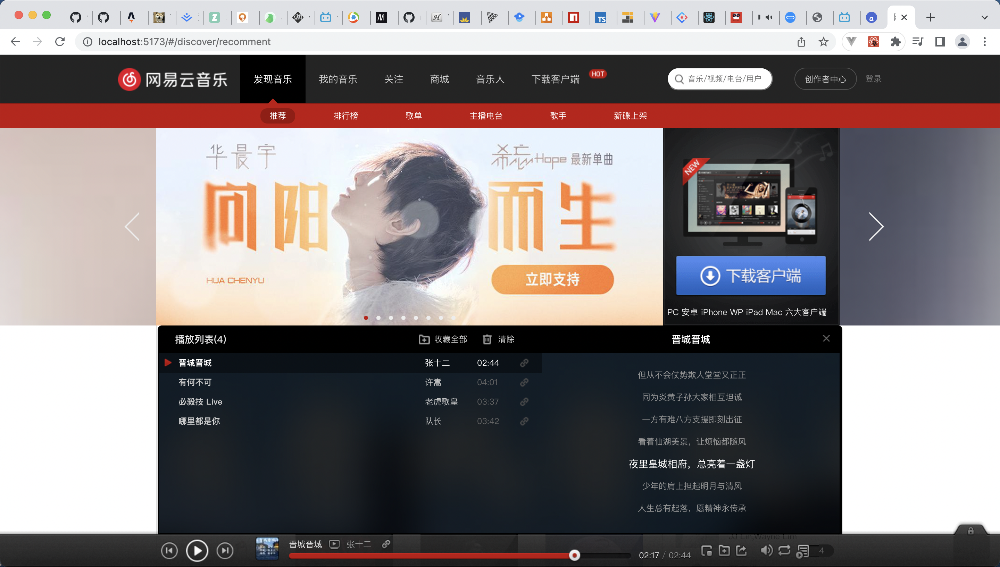

## 一个基于 vite 的 react18+ts 开发网易云 pc 端

### 项目截图

#### 首页

##### 上半部分


##### 下半部分


#### 歌词展示



#### 排行榜


#### 歌单

##### 歌单


##### 歌单类型筛选


#### 主播电台

##### 主播电台上半部分


##### 主播电台下半部分


##### 主播电台-优秀新电台&电台排行榜


##### 主播电台-推荐节目-更多


##### 主播电台-节目排行榜-更多


#### 歌手

##### 歌手-推荐歌手


##### 歌手-欧美男歌手


#### 新碟上架

##### 新碟上架


### 运行到本地

1、克隆项目

```git
git clone https://github.com/yang-xianzhu/react_ts_music.git
```

2、安装依赖

```npm
pnpm install
```

3、运行项目

```npm
pnpm serve
```
